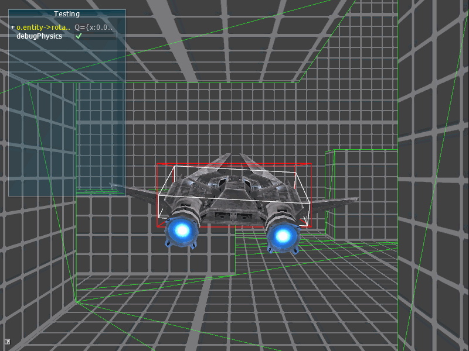
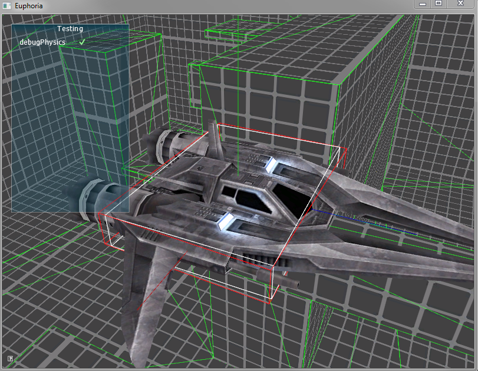

# Space Hustler

Space hustler is a [lander](https://www.youtube.com/playlist?list=PL5531857B8D63F3E1) clone that has the older version of the [euphoria](https://github.com/madeso/euphoria) engine built in.

The plan of this repo is twofold. First it serves as the old euphoria stash. Secondly, and more important, it is the repo where the game parts will be kept and euphoria is the folder for the engine part.

